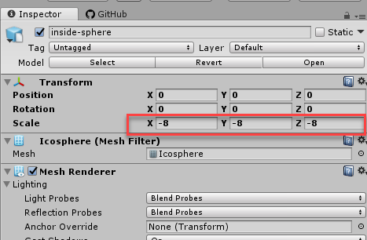
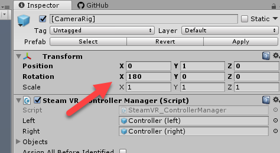

# RICOH THETA V with HTC Vive Using SteamVR

Sample project for using RICOH THETA HTC Vive with SteamVR for telepresence applications.

The 4K video stream from the THETA V will appear in HTC headset. You can see the controllers, but I am not controlling anything right now.

This is based on the [project](https://community.theta360.guide/t/tutorial-live-ricoh-theta-s-dual-fish-eye-for-steamvr-in-unity/938) by [@zimmermegan](https://community.theta360.guide/u/zimmermegan/summary) for the THETA S.

## Update RICOH THETA V Live Streaming Driver
You need 1.0.1 or later. Earlier versions will not work. See [this](https://community.theta360.guide/t/solved-unity-cant-display-theta-v-live-stream-on-windows-10/1688/39) article for info.

## Viewing Inside of Sphere
I am using a flip-normals sphere that I created in blender. This should be included in the package.

If you're interested in building your own sphere with Blender, 
[this](https://youtu.be/56QGJ76YM-s) video will give you a step-by-step process.

## Mirroring
The flip-normals sphere causing the scene to appear like a mirror image. To correct this problem, I am inverting the sphere with negative scale. -8, -8, -8.
Original hack by [@joshapplman](https://community.theta360.guide/u/joshappleman/summary) 

## Inverted Camera

I needed to rotate the X axis of the SteamVR rig by 180 degrees in order to get it to work.

## Specifying the Correct Webcam

You will need to modify the script to detect the webcam on your system.  In the example below, my THETA V is the sixth webcam that Unity detected.

  using UnityEngine;
  using System.Collections;

  public class webCamDetect : MonoBehaviour
  {

    void Start()
    {
      WebCamDevice[] devices = WebCamTexture.devices;
      Debug.Log("Number of web cams connected: " + devices.Length);
      for (int i = 0; i < devices.Length; i++)
      {
        Debug.Log(i + " " + devices[i].name);
      }
      string camName = devices[5].name;
      Debug.Log("The webcam name is " + camName);
      Renderer rend = this.GetComponentInChildren<Renderer>();
      WebCamTexture mycam = new WebCamTexture();

      mycam.deviceName = camName;
      rend.material.mainTexture = mycam;

      mycam.Play();
    }
  }
